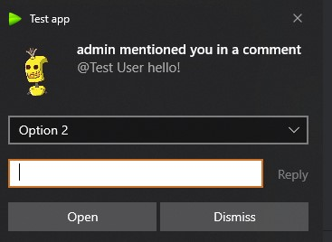
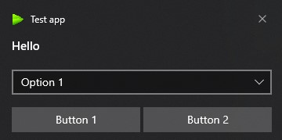

# node-win-toast-notifier
node.js wrapper for [win-toast-notifier](https://github.com/vadimart92/win-toast-notifier)
Allows to interact with user via windows toast notifications.



See examples in [notifier.test.ts](src/notifier.test.ts)

## Install 
`npm i node-win-toast-notifier`

## Application id
In order to send desktop notifications application should have registered ID. More details: https://learn.microsoft.com/en-us/windows/win32/shell/appids

## Usage in electron

```typescript
import {registerOnSquirrelStartup} from "node-win-toast-notifier";
import {build} from "./../package.json"

// register appid during electron squirrel startup
if (require("electron-squirrel-startup")) {
  (async () => {
    await registerOnSquirrelStartup('com.squirrel.my-app', 'my app', options.icons.green.big_png_win);
    app.quit();
  })();
}

app.on("ready", async () => {
  const notifier = await createNotifier({
    application_id: 'com.squirrel.my-app'
  });
  
  const notification = await notifier.notify({
    body: 'Hello',
    audio: {src: NotificationSounds.SMS},
    actions: [
      {
        actionType: 'input',
        type: 'selection',
        id: 'selectOptions',
        defaultInput: 'option1',
        selection: [
          {
            id: 'option1',
            content: 'Option 1'
          },
          {
            id: 'option2',
            content: 'Option 2'
          }
        ]
      },
      {
        actionType: 'action',
        content: 'Button 1',
        arguments: 'button1Pressed'
      }
    ]
  });
  notification.onChange(statusMessage => {
    if (statusMessage.type == StatusMessageType.Activated){
      if (statusMessage.info?.arguments === 'button1Pressed'){
        console.log(`You pressed button 1`)
      }
    }
  });
});
```

## Sending raw xml notification
 You can validate xml content via app https://www.microsoft.com/store/productid/9NBLGGH5XSL1
```typescript
var notificationXML = `
<toast>
    <visual>
        <binding template='ToastGeneric'>
            <text >Hello</text>
        </binding>
    </visual>
</toast>`;
const notification = await notifier.notifyRaw(notificationXML);
```

## How to copy binary during vite build
vite.main.config.ts
```typescript
export default defineConfig(async ({command, mode}) => {

  let viteConfig: ResolvedConfig = null, notifierCopied: boolean;
  return {
    plugins: [
      {
        name: 'copy-notifier',
        configResolved(config) {
          viteConfig = config;
        },
        async writeBundle(){
          if (!notifierCopied) {
            notifierCopied = true;
            let source = path.resolve(__dirname, `./node_modules/node-win-toast-notifier/bin/win-toast-notifier.exe`);
            let dest = path.resolve(viteConfig.build.outDir, '../bin');
            fs.mkdirSync(dest);
            fs.copyFileSync(source, path.resolve(dest, "win-toast-notifier.exe"));
            console.info('cimon-desktop-notifier.exe copied!')
          }
          return Promise.resolve(null);
        }
      } as Plugin
    ],
  }
});

```